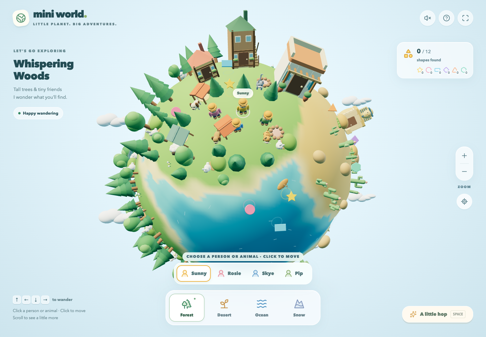

# Mini World

A gentle 3D exploration game for little adventurers. Guide people and animals around a tiny planet, visit cozy homes, swim, and collect colorful shapes. No enemies, timers, accounts, or purchases.



## Install and play

You need **Node.js 22.13+**, npm, Git, and a browser with WebGL 2 (hardware acceleration enabled).

```sh
git clone https://github.com/weijianzhg/mini-world.git
cd mini-world
npm ci
npm run dev
```

Open **http://localhost:3000**. No API keys or configuration needed. Press **Ctrl+C** in the terminal to stop.

## How to play

- **Click a person or animal**, then click the ground to move them. Arrow keys / WASD work too.
- **Click a house or animal home** to visit or rest. Use the on-screen buttons for beds, tables, and stairs.
- **Drag** to turn the planet; **scroll or pinch** to zoom; **Space** to hop.
- **Choose a region** to travel with a person. People can swim; animals stay in their home region.

Use **?** in the game for more help. Progress resets when you reload the page.

## Build and test

```sh
npm run build
npm start                 # Play the built game at localhost:3000
```

For contributors: run `npm run typecheck`, `npm run lint`, and `npm run test:server` after building. Install the test browser with `npx playwright install chromium`, then run `npm test` for the gameplay tests. The test server starts automatically.

[MIT License](LICENSE)
